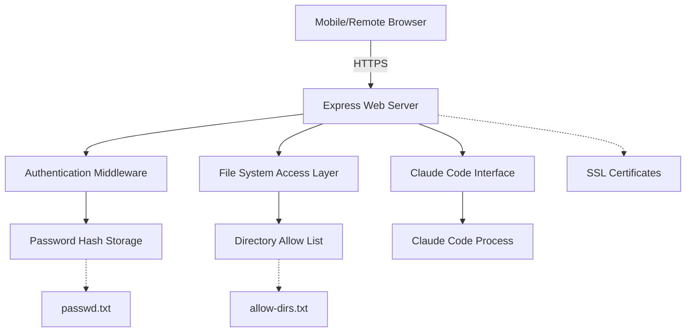
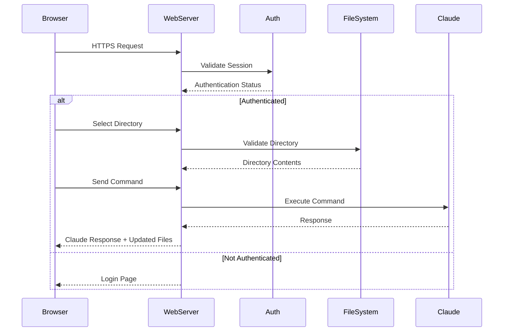

# Design Document

## Overview

The Remote Claude Web Interface is a secure desktop server application that provides web-based access to Claude Code functionality. The system consists of a Node.js/Express backend server with HTTPS support, password authentication, directory access controls, and a responsive web frontend that enables mobile and remote access to Claude Code.

## Architecture

### High-Level Architecture



### Component Interaction Flow



## Components and Interfaces

### 1. Web Server (Express.js)

**Responsibilities:**
- Serve HTTPS web interface
- Handle authentication and session management
- Route API requests
- Serve static assets (HTML, CSS, JS)

**Key Endpoints:**
- `GET /` - Main application interface (requires auth)
- `POST /login` - Authentication endpoint
- `GET /api/directories` - List allowed directories
- `POST /api/select-directory` - Switch working directory
- `GET /api/files` - Get current directory contents
- `POST /api/command` - Send command to Claude
- `POST /logout` - End session

### 2. Authentication Middleware

**Responsibilities:**
- Validate user credentials against hashed passwords
- Manage user sessions
- Protect routes requiring authentication

**Interface:**
```javascript
class AuthManager {
  validatePassword(plaintext, hashedPassword, salt)
  createSession(userId)
  validateSession(sessionToken)
  hashPassword(plaintext, salt)
}
```

### 3. File System Access Layer

**Responsibilities:**
- Enforce directory access restrictions
- Provide safe file browsing capabilities
- Validate directory paths against allow list

**Interface:**
```javascript
class FileSystemManager {
  isDirectoryAllowed(path)
  getDirectoryContents(path)
  validatePath(path)
  getFileInfo(path)
}
```

### 4. Claude Code Interface

**Responsibilities:**
- Execute Claude Code CLI commands in specified directory context
- Handle request/response formatting and validation
- Manage sandboxed execution environment
- Handle command timeouts and errors

**Implementation Architecture:**
```javascript
class ClaudeCodeIntegration {
  constructor(config) {
    this.config = config;
    this.rateLimiter = new RateLimiter(config.rateLimit);
    this.activeProcesses = new Map();
  }

  async execute(request) {
    // Rate limiting and validation
    await this.rateLimiter.acquire();
    
    // Create sandboxed environment
    const sandbox = new ClaudeCodeSandbox(
      request.userId,
      request.workingDirectory
    );
    
    // Build and execute command
    const command = this.buildCommand(request, sandbox);
    return this.executeCommand(command, sandbox);
  }

  buildCommand(request, sandbox) {
    const baseCmd = ['claude-code'];
    baseCmd.push('generate'); // or 'analyze', 'refactor', 'review'
    baseCmd.push(sandbox.sanitizePrompt(request.prompt));
    baseCmd.push('--format', 'json');
    baseCmd.push('--no-interactive');
    baseCmd.push('--directory', request.workingDirectory);
    return baseCmd;
  }
}

class ClaudeCodeSandbox {
  constructor(userId, workingDirectory) {
    this.workingDirectory = workingDirectory;
    this.allowedPaths = [workingDirectory];
  }

  validatePath(path) {
    const resolved = path.resolve(path);
    return this.allowedPaths.some(allowed => 
      resolved.startsWith(allowed)
    );
  }

  sanitizePrompt(prompt) {
    return prompt
      .replace(/[;&|`$]/g, '')
      .replace(/\.\.\//g, '')
      .slice(0, 1000);
  }

  createIsolatedEnvironment() {
    return {
      env: {
        ...process.env,
        ANTHROPIC_API_KEY: process.env.ANTHROPIC_API_KEY,
        CLAUDE_CODE_WORKSPACE: this.workingDirectory
      },
      cwd: this.workingDirectory,
      timeout: 30000,
      maxBuffer: 10 * 1024 * 1024
    };
  }
}
```

**Request/Response Format:**
```typescript
interface ClaudeCodeRequest {
  action: 'generate' | 'analyze' | 'refactor' | 'review';
  prompt: string;
  workingDirectory: string;
  options: {
    format: 'json';
    timeout?: number;
    maxTokens?: number;
  };
  userId: string;
}

interface ClaudeCodeResponse {
  success: boolean;
  result?: {
    code?: string;
    files?: Array<{
      path: string;
      content: string;
      action: 'created' | 'modified' | 'deleted';
    }>;
    analysis?: object;
    suggestions?: string[];
  };
  error?: {
    code: string;
    message: string;
  };
  metadata: {
    duration: number;
    tokensUsed: number;
  };
}
```

### 5. Configuration Manager

**Responsibilities:**
- Load and validate configuration files
- Manage SSL certificates
- Handle setup and initialization

**Interface:**
```javascript
class ConfigManager {
  loadAllowedDirectories()
  loadPasswordHash()
  generateSSLCertificates()
  validateConfiguration()
}
```

## Data Models

### Configuration Files

**passwd.txt Format:**
```
hash:salt
```

**allow-dirs.txt Format:**
```
/path/to/allowed/directory1
/path/to/allowed/directory2
/path/to/allowed/directory3
```

### API Response Models

**Directory Contents Response:**
```json
{
  "path": "/current/directory",
  "files": [
    {
      "name": "file.txt",
      "type": "file",
      "size": 1024,
      "modified": "2024-01-15T10:30:00Z"
    },
    {
      "name": "subdirectory",
      "type": "directory",
      "modified": "2024-01-15T09:15:00Z"
    }
  ]
}
```

**Claude Command Response:**
```json
{
  "success": true,
  "response": "Claude's response text",
  "filesChanged": ["file1.txt", "file2.js"],
  "executionTime": 1500
}
```

### Session Data Model

```javascript
{
  sessionId: "uuid",
  userId: "user",
  currentDirectory: "/allowed/path",
  createdAt: timestamp,
  lastActivity: timestamp
}
```

## Error Handling

### Authentication Errors
- Invalid credentials: Return 401 with login form
- Session expired: Redirect to login
- Missing session: Redirect to login

### File System Errors
- Unauthorized directory access: Return 403 error
- Directory not found: Return 404 error
- File system permissions: Return 500 with generic error

### Claude Interface Errors
- Command timeout: Return error with timeout message (E001)
- Rate limit exceeded: Return 429 with retry-after header (E002)
- Invalid prompt: Return 400 with sanitization details (E003)
- File access denied: Return 403 with path validation error (E004)
- Claude API error: Return 502 with upstream error details (E005)
- Sandbox violation: Return 403 with security violation details (E006)

### SSL/Network Errors
- Certificate issues: Log error and provide setup instructions
- Port binding failures: Suggest alternative ports
- Network connectivity: Provide troubleshooting guidance

## Testing Strategy

### Unit Tests
- Authentication middleware functionality
- File system access validation
- Configuration loading and validation
- Password hashing and verification

### Integration Tests
- End-to-end authentication flow
- Directory selection and file browsing
- Claude Code CLI command execution and response parsing
- SSL certificate generation and usage
- Sandboxed execution environment validation
- Rate limiting and timeout handling

### Security Tests
- Directory traversal attack prevention
- Session hijacking protection
- Password brute force protection
- SSL/TLS configuration validation

### Mobile Compatibility Tests
- Responsive design on various screen sizes
- Touch interface functionality
- Mobile browser compatibility
- Performance on mobile networks

## Security Considerations

### Authentication Security
- Use cryptographically secure random salt generation
- Implement session timeout and cleanup
- Rate limiting on login attempts
- Secure session token generation

### File System Security
- Strict path validation to prevent directory traversal
- Read-only access to file contents
- Whitelist-based directory access control
- Input sanitization for all file paths

### Network Security
- Enforce HTTPS for all communications
- Secure SSL/TLS configuration
- HTTP security headers (HSTS, CSP, etc.)
- Input validation and sanitization

### Claude Interface Security
- Command input sanitization (remove shell metacharacters)
- Path traversal prevention (validate against allowed directories)
- Timeout protection for long-running commands (30s default)
- Resource usage monitoring (memory/CPU limits)
- Rate limiting per user (100 requests/minute)
- Sandboxed execution environment per user
- API key protection (environment variables only)
- Error message sanitization to prevent information disclosure